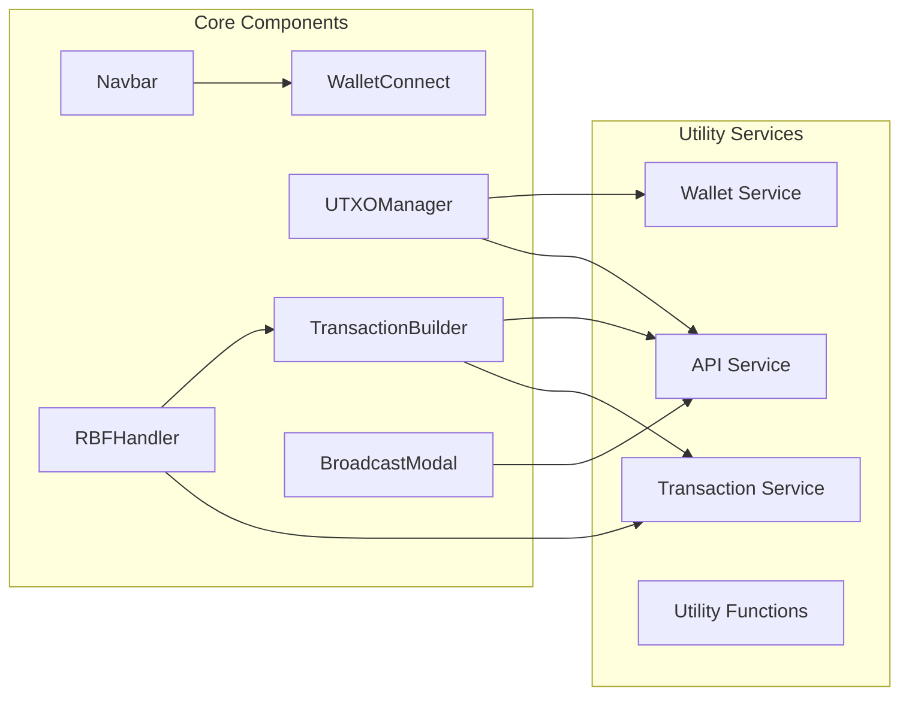
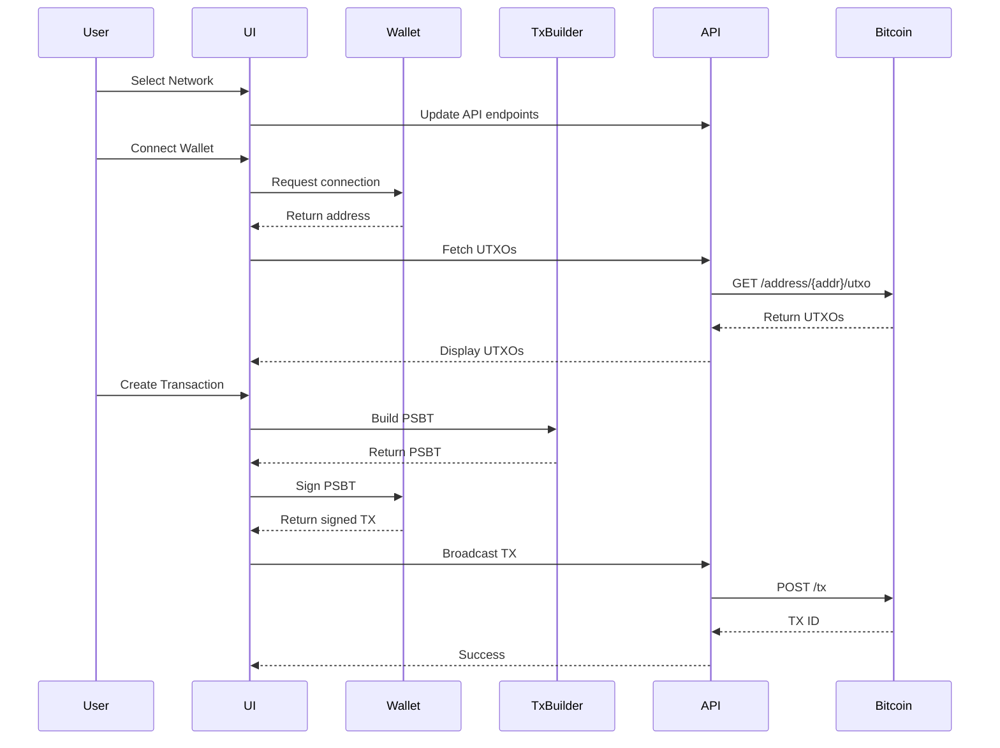

# Bitcoin UTXO Management Tool - Implementation Plan

**Created:** 2025-12-08
**Author:** Planner-Researcher Agent
**Status:** Ready for Implementation

## Executive Summary

This document provides a comprehensive implementation plan for building a Bitcoin UTXO management tool that enables users to manage their unspent transaction outputs, create transactions, implement Replace-By-Fee (RBF), and interact with multiple Bitcoin wallet providers across mainnet and testnet4 networks.

## Table of Contents

1. [Project Overview](#project-overview)
2. [Research Findings](#research-findings)
3. [Technical Architecture](#technical-architecture)
4. [Technology Stack](#technology-stack)
5. [System Design](#system-design)
6. [API Integration Strategy](#api-integration-strategy)
7. [Implementation Phases](#implementation-phases)
8. [Detailed Task Breakdown](#detailed-task-breakdown)
9. [Security Considerations](#security-considerations)
10. [Testing Strategy](#testing-strategy)
11. [Deployment Plan](#deployment-plan)
12. [TODO Checklist](#todo-checklist)

---

## 1. Project Overview

### 1.1 Purpose
Build a web-based Bitcoin UTXO management tool that provides:
- Multi-wallet connectivity (Unisat, OKX, Phantom, MetaMask, Bitget)
- UTXO visualization and management
- Transaction building, signing, and broadcasting
- Replace-By-Fee (RBF) functionality
- Network switching (mainnet/testnet4)

### 1.2 Core Features
1. **Wallet Integration**: Connect to multiple Bitcoin wallet providers
2. **UTXO Management**: View, add, and manage UTXOs
3. **Transaction Tools**: Verify, sign, and broadcast transactions (inspired by coinb.in)
4. **RBF Support**: Replace pending transactions with higher fees
5. **Network Switching**: Seamless mainnet/testnet4 toggle

### 1.3 Target Users
- Bitcoin developers testing transactions
- Power users managing UTXOs
- Wallet developers building integrations
- Anyone needing advanced Bitcoin transaction control

---

## 2. Research Findings

### 2.1 Coinb.in Analysis

**Key Features Identified:**
- Client-side transaction building (no server processing)
- Raw transaction decoder and inspector
- Multi-signature address generation
- SegWit/Bech32 support
- Timelock address creation (OP_CHECKLOCKTIMEVERIFY)
- Multiple blockchain network support
- Fee calculation based on transaction size
- OP_RETURN data support

**Security Model:**
- All processing happens in the browser
- Private keys never sent to servers
- Open-source JavaScript implementation

**Implementation Insights:**
- Uses bitcoinjs-lib for core functionality
- Modular design with separate tools (verify, sign, broadcast)
- Configuration options for signature hash types (ALL, NONE, SINGLE, ANYONECANPAY)

### 2.2 Mempool.space API Research

**Available Endpoints:**

```
Mainnet Base URL: https://mempool.space/api
Testnet4 Base URL: https://mempool.space/testnet4/api

Key Endpoints:
- GET /address/{address}/utxo - Get UTXOs for address
- GET /address/{address}/txs - Get transactions for address
- GET /tx/{txid} - Get transaction details
- GET /tx/{txid}/status - Get transaction confirmation status
- GET /tx/{txid}/hex - Get raw transaction hex
- POST /tx - Broadcast transaction
- GET /blocks/tip/height - Get current block height
- GET /fees/recommended - Get recommended fee rates
```

**API Characteristics:**
- Rate limited but generous for development
- No API key required
- RESTful design
- Returns JSON responses
- Supports both mainnet and testnet4

**Note:** Research found mempool.space is more reliable than mempool.ninja. We'll use mempool.space as primary API with fallback options.

### 2.3 Bitcoin Wallet Integration Research

#### Unisat Wallet
**API Methods:**
```javascript
window.unisat.requestAccounts() // Connect wallet
window.unisat.getAccounts() // Get current address
window.unisat.getPublicKey() // Get public key
window.unisat.getBalance() // Get balance
window.unisat.signPsbt(psbtHex) // Sign PSBT
window.unisat.pushTx(txHex) // Broadcast transaction
window.unisat.switchChain() // Change network
```

**Events:**
- `accountsChanged` - Fired when user switches accounts
- `networkChanged` - Fired when network changes

#### Phantom Wallet
**Documentation indicates Bitcoin support with:**
- Provider detection via `window.phantom.bitcoin`
- Connection establishment
- Message signing
- Transaction sending
- PSBT signing support

#### OKX Wallet
**Expected API structure (similar to Unisat):**
```javascript
window.okxwallet.bitcoin.connect()
window.okxwallet.bitcoin.getAccount()
window.okxwallet.bitcoin.signPsbt()
```

#### MetaMask & Bitget
**Research Notes:**
- MetaMask traditionally Ethereum-focused, Bitcoin support via Snaps
- Bitget wallet has multi-chain support including Bitcoin
- Both likely expose similar provider patterns

**Implementation Strategy:**
- Create unified wallet adapter interface
- Abstract wallet-specific implementations
- Handle differences in API signatures

### 2.4 Bitcoin Transaction Libraries

#### bitcoinjs-lib
**Pros:**
- Mature and widely used
- Comprehensive feature set
- Large community support
- Well-documented
- >95% test coverage

**Cons:**
- Larger bundle size
- More dependencies
- Some complexity for simple operations

#### @scure/btc-signer
**Pros:**
- Minimal and audited
- Modern API design
- Smaller bundle size (39KB gzipped)
- TypeScript-first
- No network code (security benefit)
- Supports Taproot and Schnorr signatures
- UTXO selection strategies included

**Cons:**
- Newer, smaller community
- Less extensive documentation

**Recommendation:** Use **@scure/btc-signer** as primary library for:
- Smaller bundle size
- Audited codebase
- Modern API design
- Better security profile (no network code)

### 2.5 Replace-By-Fee (RBF) Implementation

**Key Requirements:**
1. **Sequence Number Signaling (BIP 125):**
   - Any input sequence < 0xfffffffe signals RBF
   - Typically use 0xfffffffd for explicit RBF

2. **Fee Requirements:**
   - Replacement transaction must pay higher absolute fee
   - Must pay for its own relay cost
   - Increases must be meaningful (at least 1 sat/vbyte higher)

3. **Input/Output Rules:**
   - Can add new inputs
   - Can modify outputs
   - Original outputs can be reduced/removed
   - Unconfirmed parent transactions are inherited

4. **Implementation Steps:**
   ```
   1. Detect pending transaction
   2. Parse original transaction
   3. Keep same inputs (or subset)
   4. Modify outputs (adjust for higher fee)
   5. Set sequence number < 0xfffffffe
   6. Sign new transaction
   7. Broadcast replacement
   ```

### 2.6 Bitcoin Testnet4 Specifications

**Key Differences from Testnet3:**
- New genesis block (fresh start)
- Better protection against 51% attacks
- More reliable for long-term testing
- Same technical features as mainnet
- Reset network without old historical issues

**API Access:**
- Mempool.space supports testnet4: `/testnet4/api`
- Use standard Bitcoin testnet4 addresses
- Faucets available for getting testnet coins

---

## 3. Technical Architecture

### 3.1 High-Level Architecture

```mermaid
graph TB
    subgraph "Frontend Application"
        UI[React UI Components]
        WM[Wallet Manager]
        TM[Transaction Manager]
        SM[State Management]
    end

    subgraph "Wallet Providers"
        UW[Unisat]
        PW[Phantom]
        OW[OKX]
        MW[MetaMask]
        BW[Bitget]
    end

    subgraph "Bitcoin Libraries"
        BTX[@scure/btc-signer]
        ADDR[Address Utilities]
        PSBT[PSBT Handler]
    end

    subgraph "External APIs"
        MS[Mempool.space API]
        BC[Fallback APIs]
    end

    UI --> WM
    UI --> TM
    UI --> SM
    WM --> UW
    WM --> PW
    WM --> OW
    WM --> MW
    WM --> BW
    TM --> BTX
    TM --> ADDR
    TM --> PSBT
    TM --> MS
    TM --> BC
    SM --> TM
    SM --> WM
```

### 3.2 Component Architecture



### 3.3 Data Flow Architecture



---

## 4. Technology Stack

### 4.1 Frontend Framework
**Next.js 14+ (App Router)**
- **Reasoning:**
  - React-based for component reusability
  - Built-in routing
  - Server-side rendering capabilities
  - API routes for backend logic if needed
  - Excellent TypeScript support
  - Great developer experience

**Alternative:** Vite + React
- Lighter weight
- Faster development builds
- But less features out-of-box

### 4.2 UI Framework
**Tailwind CSS + shadcn/ui**
- **Reasoning:**
  - Rapid UI development
  - Highly customizable
  - Great component library (shadcn/ui)
  - Responsive by default
  - Small production bundle

**Components:**
- Navbar with network switcher
- Wallet connection modal
- UTXO table/grid
- Transaction builder forms
- Confirmation modals

### 4.3 State Management
**Zustand**
- **Reasoning:**
  - Lightweight (simple API)
  - TypeScript-friendly
  - No boilerplate
  - Perfect for wallet state, UTXOs, network selection

**Store Structure:**
```typescript
interface AppState {
  // Network
  network: 'mainnet' | 'testnet4'

  // Wallet
  connectedWallet: WalletProvider | null
  address: string | null
  publicKey: string | null

  // UTXOs
  utxos: UTXO[]
  pendingUTXOs: UTXO[]

  // UI
  isConnecting: boolean
  error: string | null
}
```

### 4.4 Bitcoin Libraries

**Primary: @scure/btc-signer**
```bash
npm install @scure/btc-signer
```

**Supporting:**
```bash
npm install bitcoinjs-lib  # Fallback for specific features
npm install bip32 bip39     # HD wallet support
npm install @noble/hashes   # Cryptographic hashing
```

### 4.5 API Client
**Axios or native fetch**
```bash
npm install axios
```

**Reasoning:**
- HTTP client for mempool.space API
- Interceptors for error handling
- Request/response transformation

### 4.6 Development Tools

```json
{
  "dependencies": {
    "next": "^14.0.0",
    "react": "^18.2.0",
    "react-dom": "^18.2.0",
    "@scure/btc-signer": "^1.2.0",
    "bitcoinjs-lib": "^6.1.5",
    "zustand": "^4.4.0",
    "axios": "^1.6.0",
    "tailwindcss": "^3.4.0",
    "@radix-ui/react-*": "latest",
    "lucide-react": "^0.300.0"
  },
  "devDependencies": {
    "typescript": "^5.3.0",
    "@types/node": "^20.0.0",
    "@types/react": "^18.2.0",
    "eslint": "^8.55.0",
    "prettier": "^3.1.0",
    "jest": "^29.7.0",
    "@testing-library/react": "^14.1.0",
    "vitest": "^1.0.0"
  }
}
```

---

## 5. System Design

### 5.1 Project Structure

```
utxo-management/
├── .claude_sessions/           # Agent session persistence
│   ├── planner-researcher/
│   ├── frontend-developer/
│   ├── tester/
│   └── shared_context.md
├── plans/                      # Implementation plans
│   └── 20251208182500_bitcoin_utxo_tool_plan.md
├── docs/                       # Project documentation
├── src/
│   ├── app/                   # Next.js app directory
│   │   ├── layout.tsx
│   │   ├── page.tsx           # Home/UTXO manager page
│   │   ├── verify/
│   │   │   └── page.tsx      # Transaction verifier
│   │   ├── sign/
│   │   │   └── page.tsx      # Transaction signer
│   │   └── broadcast/
│   │       └── page.tsx      # Transaction broadcaster
│   ├── components/            # React components
│   │   ├── layout/
│   │   │   ├── Navbar.tsx
│   │   │   └── Footer.tsx
│   │   ├── wallet/
│   │   │   ├── WalletConnectButton.tsx
│   │   │   ├── WalletModal.tsx
│   │   │   └── NetworkSwitcher.tsx
│   │   ├── utxo/
│   │   │   ├── UTXOList.tsx
│   │   │   ├── UTXOCard.tsx
│   │   │   ├── AddUTXOForm.tsx
│   │   │   └── PendingBadge.tsx
│   │   ├── transaction/
│   │   │   ├── TransactionBuilder.tsx
│   │   │   ├── TransactionVerifier.tsx
│   │   │   ├── TransactionSigner.tsx
│   │   │   └── BroadcastModal.tsx
│   │   ├── rbf/
│   │   │   ├── RBFModal.tsx
│   │   │   └── FeeEstimator.tsx
│   │   └── ui/                # shadcn/ui components
│   │       ├── button.tsx
│   │       ├── card.tsx
│   │       ├── dialog.tsx
│   │       └── ...
│   ├── lib/                   # Core libraries
│   │   ├── wallets/
│   │   │   ├── types.ts
│   │   │   ├── base-adapter.ts
│   │   │   ├── unisat-adapter.ts
│   │   │   ├── phantom-adapter.ts
│   │   │   ├── okx-adapter.ts
│   │   │   ├── metamask-adapter.ts
│   │   │   ├── bitget-adapter.ts
│   │   │   └── wallet-manager.ts
│   │   ├── bitcoin/
│   │   │   ├── transaction.ts
│   │   │   ├── psbt.ts
│   │   │   ├── address.ts
│   │   │   ├── rbf.ts
│   │   │   └── fee-estimator.ts
│   │   ├── api/
│   │   │   ├── mempool.ts
│   │   │   ├── types.ts
│   │   │   └── client.ts
│   │   └── utils/
│   │       ├── format.ts
│   │       ├── validation.ts
│   │       └── constants.ts
│   ├── store/                 # Zustand stores
│   │   ├── wallet-store.ts
│   │   ├── utxo-store.ts
│   │   └── network-store.ts
│   ├── hooks/                 # Custom React hooks
│   │   ├── useWallet.ts
│   │   ├── useUTXOs.ts
│   │   ├── useTransaction.ts
│   │   └── useRBF.ts
│   └── types/                 # TypeScript types
│       ├── wallet.ts
│       ├── utxo.ts
│       ├── transaction.ts
│       └── api.ts
├── public/                    # Static assets
├── tests/                     # Test files
│   ├── unit/
│   ├── integration/
│   └── e2e/
├── .env.example
├── .gitignore
├── next.config.js
├── tailwind.config.js
├── tsconfig.json
├── package.json
└── README.md
```

### 5.2 Core Interfaces and Types

```typescript
// src/types/wallet.ts
export type WalletProvider = 'unisat' | 'phantom' | 'okx' | 'metamask' | 'bitget'
export type BitcoinNetwork = 'mainnet' | 'testnet4'

export interface WalletAdapter {
  name: WalletProvider
  connect(): Promise<string>
  disconnect(): Promise<void>
  getAddress(): Promise<string>
  getPublicKey(): Promise<string>
  signPsbt(psbtHex: string): Promise<string>
  signMessage(message: string): Promise<string>
  pushTransaction(txHex: string): Promise<string>
  switchNetwork(network: BitcoinNetwork): Promise<void>
  isInstalled(): boolean
}

// src/types/utxo.ts
export interface UTXO {
  txid: string
  vout: number
  value: number // satoshis
  status: UTXOStatus
  scriptPubKey?: string
  address?: string
}

export interface UTXOStatus {
  confirmed: boolean
  block_height?: number
  block_hash?: string
  block_time?: number
}

// src/types/transaction.ts
export interface Transaction {
  txid: string
  version: number
  locktime: number
  vin: TransactionInput[]
  vout: TransactionOutput[]
  size: number
  weight: number
  fee: number
  status: TransactionStatus
}

export interface TransactionInput {
  txid: string
  vout: number
  prevout: TransactionOutput
  scriptsig: string
  witness: string[]
  sequence: number
  is_coinbase: boolean
}

export interface TransactionOutput {
  scriptpubkey: string
  scriptpubkey_asm: string
  scriptpubkey_type: string
  scriptpubkey_address: string
  value: number
}

export interface TransactionStatus {
  confirmed: boolean
  block_height?: number
  block_hash?: string
  block_time?: number
}

// src/types/rbf.ts
export interface RBFTransaction {
  originalTxid: string
  originalFee: number
  newFee: number
  feeIncrease: number
  inputs: TransactionInput[]
  outputs: TransactionOutput[]
}
```

### 5.3 Database Schema

**Note:** This tool can be fully client-side with no backend database. All data can be:
- Fetched from blockchain via APIs
- Stored in browser localStorage/sessionStorage
- Managed in application state

**Optional IndexedDB Schema (for offline/caching):**

```typescript
interface UTXOCache {
  address: string
  network: BitcoinNetwork
  utxos: UTXO[]
  lastUpdated: number
}

interface TransactionCache {
  txid: string
  network: BitcoinNetwork
  transaction: Transaction
  lastUpdated: number
}

interface CustomUTXO {
  id: string
  txid: string
  vout: number
  value: number
  scriptPubKey: string
  address: string
  label?: string
  createdAt: number
}
```

---

## 6. API Integration Strategy

### 6.1 Mempool.space API Integration

**Base Configuration:**

```typescript
// src/lib/api/client.ts
import axios from 'axios'

const MAINNET_BASE_URL = 'https://mempool.space/api'
const TESTNET4_BASE_URL = 'https://mempool.space/testnet4/api'

export class MempoolClient {
  private baseURL: string
  private client: AxiosInstance

  constructor(network: BitcoinNetwork) {
    this.baseURL = network === 'mainnet' ? MAINNET_BASE_URL : TESTNET4_BASE_URL
    this.client = axios.create({
      baseURL: this.baseURL,
      timeout: 30000,
      headers: {
        'Content-Type': 'application/json'
      }
    })

    // Add response interceptor for error handling
    this.client.interceptors.response.use(
      response => response,
      error => this.handleError(error)
    )
  }

  // Switch network dynamically
  switchNetwork(network: BitcoinNetwork) {
    this.baseURL = network === 'mainnet' ? MAINNET_BASE_URL : TESTNET4_BASE_URL
    this.client.defaults.baseURL = this.baseURL
  }

  private handleError(error: any) {
    if (error.response) {
      // Server responded with error
      throw new Error(`API Error: ${error.response.data}`)
    } else if (error.request) {
      // Request made but no response
      throw new Error('Network error: No response from server')
    } else {
      throw new Error(`Request error: ${error.message}`)
    }
  }
}
```

**Key API Methods:**

```typescript
// src/lib/api/mempool.ts
export class MempoolAPI extends MempoolClient {
  // Get UTXOs for address
  async getAddressUTXOs(address: string): Promise<UTXO[]> {
    const response = await this.client.get(`/address/${address}/utxo`)
    return response.data
  }

  // Get address transactions
  async getAddressTransactions(address: string): Promise<Transaction[]> {
    const response = await this.client.get(`/address/${address}/txs`)
    return response.data
  }

  // Get transaction details
  async getTransaction(txid: string): Promise<Transaction> {
    const response = await this.client.get(`/tx/${txid}`)
    return response.data
  }

  // Get transaction status
  async getTransactionStatus(txid: string): Promise<TransactionStatus> {
    const response = await this.client.get(`/tx/${txid}/status`)
    return response.data
  }

  // Get raw transaction hex
  async getRawTransaction(txid: string): Promise<string> {
    const response = await this.client.get(`/tx/${txid}/hex`)
    return response.data
  }

  // Broadcast transaction
  async broadcastTransaction(txHex: string): Promise<string> {
    const response = await this.client.post('/tx', txHex, {
      headers: { 'Content-Type': 'text/plain' }
    })
    return response.data // Returns txid
  }

  // Get recommended fees
  async getRecommendedFees(): Promise<FeeEstimates> {
    const response = await this.client.get('/fees/recommended')
    return response.data
  }

  // Get current block height
  async getCurrentBlockHeight(): Promise<number> {
    const response = await this.client.get('/blocks/tip/height')
    return response.data
  }
}

interface FeeEstimates {
  fastestFee: number    // sat/vB
  halfHourFee: number   // sat/vB
  hourFee: number       // sat/vB
  economyFee: number    // sat/vB
  minimumFee: number    // sat/vB
}
```

### 6.2 Error Handling and Retry Strategy

```typescript
// src/lib/api/client.ts
export class ResilientMempoolAPI {
  private primaryAPI: MempoolAPI
  private retryCount: number = 3
  private retryDelay: number = 1000 // ms

  async getAddressUTXOsWithRetry(address: string): Promise<UTXO[]> {
    for (let i = 0; i < this.retryCount; i++) {
      try {
        return await this.primaryAPI.getAddressUTXOs(address)
      } catch (error) {
        if (i === this.retryCount - 1) throw error
        await this.delay(this.retryDelay * (i + 1))
      }
    }
    throw new Error('Max retries exceeded')
  }

  private delay(ms: number): Promise<void> {
    return new Promise(resolve => setTimeout(resolve, ms))
  }
}
```

### 6.3 Rate Limiting Strategy

```typescript
// src/lib/api/rate-limiter.ts
class RateLimiter {
  private queue: Array<() => Promise<any>> = []
  private processing: boolean = false
  private requestsPerSecond: number = 10
  private minDelay: number = 1000 / this.requestsPerSecond

  async enqueue<T>(fn: () => Promise<T>): Promise<T> {
    return new Promise((resolve, reject) => {
      this.queue.push(async () => {
        try {
          const result = await fn()
          resolve(result)
        } catch (error) {
          reject(error)
        }
      })
      this.processQueue()
    })
  }

  private async processQueue() {
    if (this.processing || this.queue.length === 0) return

    this.processing = true
    const fn = this.queue.shift()!

    await fn()
    await this.delay(this.minDelay)

    this.processing = false
    this.processQueue()
  }

  private delay(ms: number): Promise<void> {
    return new Promise(resolve => setTimeout(resolve, ms))
  }
}
```

---

## 7. Implementation Phases

### Phase 1: Project Setup and Core Infrastructure (Week 1)
**Goal:** Establish project foundation and development environment

**Tasks:**
1. Initialize Next.js project with TypeScript
2. Configure Tailwind CSS and shadcn/ui
3. Set up project structure (folders, files)
4. Install and configure core dependencies
5. Set up ESLint, Prettier, and Git hooks
6. Create basic layout components (Navbar, Footer)
7. Implement network switching UI
8. Set up Zustand stores

**Deliverables:**
- Runnable Next.js application
- Basic UI layout
- State management configured
- Development environment ready

### Phase 2: Wallet Integration (Week 2)
**Goal:** Implement multi-wallet connectivity

**Tasks:**
1. Create wallet adapter interface
2. Implement Unisat wallet adapter
3. Implement Phantom wallet adapter
4. Implement OKX wallet adapter
5. Implement MetaMask wallet adapter (Bitcoin Snaps)
6. Implement Bitget wallet adapter
7. Create wallet manager service
8. Build wallet connection UI components
9. Implement wallet state management
10. Add wallet event listeners (account/network changes)
11. Test wallet connections across all providers

**Deliverables:**
- Working wallet connectivity for all 5 providers
- Wallet selection modal
- Account/network change handling
- Connection persistence

### Phase 3: API Integration and UTXO Management (Week 3)
**Goal:** Fetch and display UTXOs from blockchain

**Tasks:**
1. Implement Mempool.space API client
2. Create API error handling and retry logic
3. Implement rate limiting
4. Build UTXO fetching service
5. Create UTXO list component
6. Implement pending UTXO detection
7. Add custom UTXO input form
8. Create UTXO card/row component
9. Implement UTXO filtering and sorting
10. Add UTXO selection functionality
11. Implement UTXO caching (IndexedDB optional)

**Deliverables:**
- Working UTXO list page
- Real-time UTXO data from blockchain
- Custom UTXO addition
- Pending transaction detection
- UTXO management interface

### Phase 4: Transaction Building and Signing (Week 4)
**Goal:** Implement transaction creation tools

**Tasks:**
1. Integrate @scure/btc-signer library
2. Create transaction builder service
3. Implement PSBT creation
4. Build transaction input/output forms
5. Create transaction preview component
6. Implement fee estimation
7. Add transaction signing flow
8. Create transaction verification page
9. Implement raw transaction decoder
10. Add transaction inspection UI
11. Build signature hash type selector

**Deliverables:**
- Transaction builder interface
- PSBT creation and signing
- Transaction verification tool
- Fee estimation
- Transaction preview

### Phase 5: Transaction Broadcasting (Week 5)
**Goal:** Broadcast transactions to network

**Tasks:**
1. Implement broadcast service
2. Create broadcast modal UI
3. Add transaction confirmation flow
4. Implement broadcast error handling
5. Create broadcast success/failure feedback
6. Add transaction tracking after broadcast
7. Implement transaction status polling
8. Create transaction history view
9. Add transaction details modal
10. Implement mempool monitoring

**Deliverables:**
- Working transaction broadcasting
- Broadcast confirmation UI
- Transaction status tracking
- Transaction history

### Phase 6: RBF Implementation (Week 6)
**Goal:** Implement Replace-By-Fee functionality

**Tasks:**
1. Implement RBF detection logic
2. Create RBF transaction builder
3. Build RBF modal UI
4. Implement fee bumping calculator
5. Add output adjustment logic
6. Create RBF preview component
7. Implement RBF signing flow
8. Add RBF broadcast functionality
9. Create RBF history tracking
10. Add RBF validation checks

**Deliverables:**
- Working RBF functionality
- RBF transaction builder
- Fee bumping interface
- RBF confirmation and broadcast

### Phase 7: Testing and Quality Assurance (Week 7)
**Goal:** Ensure application reliability and security

**Tasks:**
1. Write unit tests for utility functions
2. Write unit tests for wallet adapters
3. Write unit tests for transaction services
4. Create integration tests for wallet flows
5. Create integration tests for transaction flows
6. Implement E2E tests for critical paths
7. Test on mainnet (with small amounts)
8. Test on testnet4 extensively
9. Security audit of wallet integration
10. Performance optimization
11. Cross-browser testing
12. Mobile responsiveness testing

**Deliverables:**
- Comprehensive test suite
- Security audit report
- Performance benchmarks
- Cross-platform compatibility

### Phase 8: Documentation and Deployment (Week 8)
**Goal:** Document and deploy application

**Tasks:**
1. Write user documentation
2. Create developer documentation
3. Document API integration
4. Create wallet integration guides
5. Write deployment guide
6. Set up CI/CD pipeline
7. Configure production environment
8. Deploy to hosting platform
9. Set up monitoring and analytics
10. Create troubleshooting guide

**Deliverables:**
- Complete documentation
- Deployed application
- CI/CD pipeline
- Monitoring setup

---

## 8. Detailed Task Breakdown

### 8.1 Project Initialization

```bash
# Initialize Next.js project
npx create-next-app@latest utxo-management --typescript --tailwind --app --src-dir

# Navigate to project
cd utxo-management

# Install core dependencies
npm install @scure/btc-signer bitcoinjs-lib zustand axios

# Install UI dependencies
npm install @radix-ui/react-dialog @radix-ui/react-dropdown-menu @radix-ui/react-tabs
npm install lucide-react class-variance-authority clsx tailwind-merge

# Install dev dependencies
npm install -D @types/node @types/react @types/react-dom
npm install -D eslint prettier eslint-config-prettier
npm install -D vitest @testing-library/react @testing-library/jest-dom
npm install -D husky lint-staged

# Initialize shadcn/ui
npx shadcn-ui@latest init
```

**Configuration Files:**

```typescript
// next.config.js
/** @type {import('next').NextConfig} */
const nextConfig = {
  reactStrictMode: true,
  webpack: (config) => {
    config.resolve.fallback = {
      ...config.resolve.fallback,
      fs: false,
      net: false,
      tls: false,
    }
    return config
  },
}

module.exports = nextConfig
```

```json
// tsconfig.json
{
  "compilerOptions": {
    "target": "ES2020",
    "lib": ["ES2020", "DOM", "DOM.Iterable"],
    "jsx": "preserve",
    "module": "ESNext",
    "moduleResolution": "bundler",
    "resolveJsonModule": true,
    "allowJs": true,
    "strict": true,
    "noEmit": true,
    "esModuleInterop": true,
    "skipLibCheck": true,
    "forceConsistentCasingInFileNames": true,
    "incremental": true,
    "paths": {
      "@/*": ["./src/*"]
    }
  },
  "include": ["next-env.d.ts", "**/*.ts", "**/*.tsx"],
  "exclude": ["node_modules"]
}
```

```javascript
// tailwind.config.js
/** @type {import('tailwindcss').Config} */
module.exports = {
  darkMode: ["class"],
  content: [
    './pages/**/*.{ts,tsx}',
    './components/**/*.{ts,tsx}',
    './app/**/*.{ts,tsx}',
    './src/**/*.{ts,tsx}',
  ],
  theme: {
    extend: {
      colors: {
        bitcoin: {
          orange: '#f7931a',
          gray: '#4d4d4d',
        },
      },
    },
  },
  plugins: [require("tailwindcss-animate")],
}
```

### 8.2 Wallet Adapter Implementation

**Base Adapter Interface:**

```typescript
// src/lib/wallets/base-adapter.ts
import { WalletAdapter, WalletProvider, BitcoinNetwork } from '@/types/wallet'

export abstract class BaseWalletAdapter implements WalletAdapter {
  abstract name: WalletProvider
  protected provider: any
  protected currentAddress: string | null = null
  protected currentNetwork: BitcoinNetwork = 'mainnet'

  abstract isInstalled(): boolean
  protected abstract getProvider(): any

  async connect(): Promise<string> {
    if (!this.isInstalled()) {
      throw new Error(`${this.name} wallet is not installed`)
    }

    try {
      this.provider = this.getProvider()
      const addresses = await this.provider.requestAccounts()
      this.currentAddress = addresses[0]
      return this.currentAddress
    } catch (error) {
      throw new Error(`Failed to connect to ${this.name}: ${error}`)
    }
  }

  async disconnect(): Promise<void> {
    this.currentAddress = null
  }

  async getAddress(): Promise<string> {
    if (!this.currentAddress) {
      throw new Error('Wallet not connected')
    }
    return this.currentAddress
  }

  abstract getPublicKey(): Promise<string>
  abstract signPsbt(psbtHex: string): Promise<string>
  abstract signMessage(message: string): Promise<string>
  abstract pushTransaction(txHex: string): Promise<string>
  abstract switchNetwork(network: BitcoinNetwork): Promise<void>

  protected setupEventListeners() {
    // Override in subclasses to handle wallet events
  }
}
```

**Unisat Adapter:**

```typescript
// src/lib/wallets/unisat-adapter.ts
import { BaseWalletAdapter } from './base-adapter'
import { WalletProvider, BitcoinNetwork } from '@/types/wallet'

declare global {
  interface Window {
    unisat?: any
  }
}

export class UnisatAdapter extends BaseWalletAdapter {
  name: WalletProvider = 'unisat'

  isInstalled(): boolean {
    return typeof window !== 'undefined' && typeof window.unisat !== 'undefined'
  }

  protected getProvider(): any {
    return window.unisat
  }

  async getPublicKey(): Promise<string> {
    if (!this.provider) throw new Error('Provider not initialized')
    return await this.provider.getPublicKey()
  }

  async signPsbt(psbtHex: string): Promise<string> {
    if (!this.provider) throw new Error('Provider not initialized')
    return await this.provider.signPsbt(psbtHex)
  }

  async signMessage(message: string): Promise<string> {
    if (!this.provider) throw new Error('Provider not initialized')
    return await this.provider.signMessage(message)
  }

  async pushTransaction(txHex: string): Promise<string> {
    if (!this.provider) throw new Error('Provider not initialized')
    return await this.provider.pushTx(txHex)
  }

  async switchNetwork(network: BitcoinNetwork): Promise<void> {
    if (!this.provider) throw new Error('Provider not initialized')
    const chain = network === 'mainnet' ? 'BITCOIN_MAINNET' : 'BITCOIN_TESTNET'
    await this.provider.switchChain(chain)
    this.currentNetwork = network
  }

  protected setupEventListeners() {
    if (!this.provider) return

    this.provider.on('accountsChanged', (accounts: string[]) => {
      this.currentAddress = accounts[0] || null
      // Emit event to app
      window.dispatchEvent(new CustomEvent('walletAccountChanged', {
        detail: { address: this.currentAddress }
      }))
    })

    this.provider.on('networkChanged', (network: string) => {
      // Handle network change
      window.dispatchEvent(new CustomEvent('walletNetworkChanged', {
        detail: { network }
      }))
    })
  }
}
```

**Wallet Manager:**

```typescript
// src/lib/wallets/wallet-manager.ts
import { WalletAdapter, WalletProvider } from '@/types/wallet'
import { UnisatAdapter } from './unisat-adapter'
import { PhantomAdapter } from './phantom-adapter'
import { OKXAdapter } from './okx-adapter'
import { MetaMaskAdapter } from './metamask-adapter'
import { BitgetAdapter } from './bitget-adapter'

export class WalletManager {
  private adapters: Map<WalletProvider, WalletAdapter>
  private currentAdapter: WalletAdapter | null = null

  constructor() {
    this.adapters = new Map([
      ['unisat', new UnisatAdapter()],
      ['phantom', new PhantomAdapter()],
      ['okx', new OKXAdapter()],
      ['metamask', new MetaMaskAdapter()],
      ['bitget', new BitgetAdapter()],
    ])
  }

  getAvailableWallets(): WalletProvider[] {
    return Array.from(this.adapters.entries())
      .filter(([_, adapter]) => adapter.isInstalled())
      .map(([provider, _]) => provider)
  }

  async connect(provider: WalletProvider): Promise<string> {
    const adapter = this.adapters.get(provider)
    if (!adapter) {
      throw new Error(`Wallet provider ${provider} not supported`)
    }

    if (!adapter.isInstalled()) {
      throw new Error(`${provider} wallet is not installed`)
    }

    const address = await adapter.connect()
    this.currentAdapter = adapter
    return address
  }

  async disconnect(): Promise<void> {
    if (this.currentAdapter) {
      await this.currentAdapter.disconnect()
      this.currentAdapter = null
    }
  }

  getCurrentAdapter(): WalletAdapter | null {
    return this.currentAdapter
  }

  isConnected(): boolean {
    return this.currentAdapter !== null
  }
}
```

### 8.3 State Management

```typescript
// src/store/wallet-store.ts
import { create } from 'zustand'
import { persist } from 'zustand/middleware'
import { WalletProvider, BitcoinNetwork } from '@/types/wallet'

interface WalletState {
  // Connection state
  isConnected: boolean
  connectedWallet: WalletProvider | null
  address: string | null
  publicKey: string | null

  // Network
  network: BitcoinNetwork

  // UI state
  isConnecting: boolean
  error: string | null

  // Actions
  setConnected: (wallet: WalletProvider, address: string, publicKey: string) => void
  setDisconnected: () => void
  setNetwork: (network: BitcoinNetwork) => void
  setError: (error: string | null) => void
  setConnecting: (isConnecting: boolean) => void
}

export const useWalletStore = create<WalletState>()(
  persist(
    (set) => ({
      // Initial state
      isConnected: false,
      connectedWallet: null,
      address: null,
      publicKey: null,
      network: 'mainnet',
      isConnecting: false,
      error: null,

      // Actions
      setConnected: (wallet, address, publicKey) =>
        set({
          isConnected: true,
          connectedWallet: wallet,
          address,
          publicKey,
          error: null,
        }),

      setDisconnected: () =>
        set({
          isConnected: false,
          connectedWallet: null,
          address: null,
          publicKey: null,
        }),

      setNetwork: (network) => set({ network }),

      setError: (error) => set({ error }),

      setConnecting: (isConnecting) => set({ isConnecting }),
    }),
    {
      name: 'wallet-storage',
      partialize: (state) => ({
        network: state.network,
        // Don't persist sensitive connection info
      }),
    }
  )
)
```

```typescript
// src/store/utxo-store.ts
import { create } from 'zustand'
import { UTXO } from '@/types/utxo'

interface UTXOState {
  utxos: UTXO[]
  selectedUTXOs: string[] // Array of "txid:vout" identifiers
  isLoading: boolean
  error: string | null
  lastFetched: number | null

  // Actions
  setUTXOs: (utxos: UTXO[]) => void
  addCustomUTXO: (utxo: UTXO) => void
  removeUTXO: (txid: string, vout: number) => void
  selectUTXO: (txid: string, vout: number) => void
  deselectUTXO: (txid: string, vout: number) => void
  clearSelection: () => void
  setLoading: (isLoading: boolean) => void
  setError: (error: string | null) => void
}

export const useUTXOStore = create<UTXOState>((set, get) => ({
  utxos: [],
  selectedUTXOs: [],
  isLoading: false,
  error: null,
  lastFetched: null,

  setUTXOs: (utxos) =>
    set({
      utxos,
      lastFetched: Date.now(),
      error: null,
    }),

  addCustomUTXO: (utxo) =>
    set((state) => ({
      utxos: [...state.utxos, utxo],
    })),

  removeUTXO: (txid, vout) =>
    set((state) => ({
      utxos: state.utxos.filter((u) => !(u.txid === txid && u.vout === vout)),
    })),

  selectUTXO: (txid, vout) =>
    set((state) => ({
      selectedUTXOs: [...state.selectedUTXOs, `${txid}:${vout}`],
    })),

  deselectUTXO: (txid, vout) =>
    set((state) => ({
      selectedUTXOs: state.selectedUTXOs.filter((id) => id !== `${txid}:${vout}`),
    })),

  clearSelection: () => set({ selectedUTXOs: [] }),

  setLoading: (isLoading) => set({ isLoading }),

  setError: (error) => set({ error }),
}))
```

### 8.4 Transaction Builder Service

```typescript
// src/lib/bitcoin/transaction.ts
import * as btc from '@scure/btc-signer'
import { UTXO, TransactionInput, TransactionOutput } from '@/types'

export class TransactionBuilder {
  private network: btc.Network

  constructor(isTestnet: boolean = false) {
    this.network = isTestnet ? btc.TEST_NETWORK : btc.NETWORK
  }

  /**
   * Create a PSBT from UTXOs and outputs
   */
  createPSBT(
    inputs: UTXO[],
    outputs: TransactionOutput[],
    feeRate: number,
    enableRBF: boolean = true
  ): string {
    const tx = new btc.Transaction()

    // Add inputs
    inputs.forEach((utxo) => {
      tx.addInput({
        txid: utxo.txid,
        index: utxo.vout,
        sequence: enableRBF ? 0xfffffffd : 0xffffffff, // RBF signaling
      })
    })

    // Add outputs
    outputs.forEach((output) => {
      tx.addOutputAddress(output.address, BigInt(output.value), this.network)
    })

    // Calculate and verify fee
    const estimatedSize = tx.estimateSize()
    const estimatedFee = estimatedSize * feeRate

    return tx.toPSBT()
  }

  /**
   * Finalize and extract transaction from PSBT
   */
  finalizePSBT(psbtHex: string): string {
    const tx = btc.Transaction.fromPSBT(Buffer.from(psbtHex, 'hex'))
    tx.finalize()
    return tx.hex
  }

  /**
   * Decode raw transaction
   */
  decodeTransaction(txHex: string): any {
    const tx = btc.Transaction.fromRaw(Buffer.from(txHex, 'hex'))
    return {
      version: tx.version,
      inputs: tx.inputs,
      outputs: tx.outputs,
      locktime: tx.locktime,
    }
  }

  /**
   * Calculate transaction virtual size
   */
  calculateVSize(txHex: string): number {
    const tx = btc.Transaction.fromRaw(Buffer.from(txHex, 'hex'))
    return tx.vsize
  }

  /**
   * Verify transaction signature
   */
  verifyTransaction(txHex: string): boolean {
    try {
      const tx = btc.Transaction.fromRaw(Buffer.from(txHex, 'hex'))
      // Perform verification checks
      return true
    } catch (error) {
      return false
    }
  }
}
```

### 8.5 RBF Implementation

```typescript
// src/lib/bitcoin/rbf.ts
import { TransactionBuilder } from './transaction'
import { UTXO, Transaction, TransactionOutput } from '@/types'
import { MempoolAPI } from '../api/mempool'

export class RBFHandler {
  private txBuilder: TransactionBuilder
  private api: MempoolAPI

  constructor(isTestnet: boolean, api: MempoolAPI) {
    this.txBuilder = new TransactionBuilder(isTestnet)
    this.api = api
  }

  /**
   * Check if transaction is RBF-enabled
   */
  isRBFEnabled(transaction: Transaction): boolean {
    return transaction.vin.some((input) => input.sequence < 0xfffffffe)
  }

  /**
   * Calculate minimum fee for RBF
   */
  calculateMinimumReplacementFee(
    originalFee: number,
    originalSize: number,
    newSize: number
  ): number {
    // BIP 125 rules:
    // 1. New fee must be higher than original
    // 2. Must pay for its own relay cost
    const minFeeRate = 1 // sat/vB
    const additionalFee = Math.max(newSize * minFeeRate, originalFee * 0.01)
    return Math.ceil(originalFee + additionalFee)
  }

  /**
   * Create RBF replacement transaction
   */
  async createReplacementTransaction(
    originalTxid: string,
    newFeeRate: number,
    newOutputs?: TransactionOutput[]
  ): Promise<string> {
    // Fetch original transaction
    const originalTx = await this.api.getTransaction(originalTxid)

    if (!this.isRBFEnabled(originalTx)) {
      throw new Error('Original transaction is not RBF-enabled')
    }

    // Use same inputs
    const inputs: UTXO[] = originalTx.vin.map((input) => ({
      txid: input.txid,
      vout: input.vout,
      value: input.prevout.value,
      status: { confirmed: false },
    }))

    // Calculate new fee
    const outputs = newOutputs || originalTx.vout
    const inputValue = inputs.reduce((sum, input) => sum + input.value, 0)
    const outputValue = outputs.reduce((sum, output) => sum + output.value, 0)

    const estimatedSize = 250 // Rough estimate, refine based on actual tx
    const newFee = estimatedSize * newFeeRate
    const minFee = this.calculateMinimumReplacementFee(
      originalTx.fee,
      originalTx.size,
      estimatedSize
    )

    if (newFee < minFee) {
      throw new Error(`Fee too low. Minimum: ${minFee} sats`)
    }

    // Adjust change output to account for new fee
    const adjustedOutputs = this.adjustOutputsForFee(outputs, newFee, inputValue)

    // Create new PSBT with RBF enabled
    return this.txBuilder.createPSBT(inputs, adjustedOutputs, newFeeRate, true)
  }

  /**
   * Adjust outputs to accommodate new fee
   */
  private adjustOutputsForFee(
    outputs: TransactionOutput[],
    newFee: number,
    totalInput: number
  ): TransactionOutput[] {
    const totalOutput = outputs.reduce((sum, out) => sum + out.value, 0)
    const currentFee = totalInput - totalOutput
    const feeIncrease = newFee - currentFee

    // Find change output (usually the last one or largest one to same wallet)
    // For simplicity, reduce the last output
    const adjustedOutputs = [...outputs]
    const lastOutput = adjustedOutputs[adjustedOutputs.length - 1]

    if (lastOutput.value < feeIncrease) {
      throw new Error('Insufficient funds in change output to increase fee')
    }

    adjustedOutputs[adjustedOutputs.length - 1] = {
      ...lastOutput,
      value: lastOutput.value - feeIncrease,
    }

    return adjustedOutputs
  }

  /**
   * Validate RBF transaction before broadcast
   */
  validateRBFTransaction(
    originalTx: Transaction,
    replacementPsbt: string
  ): { valid: boolean; errors: string[] } {
    const errors: string[] = []

    // Check RBF signaling
    if (!this.isRBFEnabled(originalTx)) {
      errors.push('Original transaction does not signal RBF')
    }

    // Additional validation checks...
    // - Fee comparison
    // - Input matching
    // - Output validation

    return {
      valid: errors.length === 0,
      errors,
    }
  }
}
```

### 8.6 Fee Estimation

```typescript
// src/lib/bitcoin/fee-estimator.ts
import { MempoolAPI } from '../api/mempool'

export class FeeEstimator {
  private api: MempoolAPI

  constructor(api: MempoolAPI) {
    this.api = api
  }

  /**
   * Get recommended fee rates
   */
  async getRecommendedFees() {
    return await this.api.getRecommendedFees()
  }

  /**
   * Calculate total fee for transaction
   */
  calculateFee(vsize: number, feeRate: number): number {
    return Math.ceil(vsize * feeRate)
  }

  /**
   * Estimate transaction size
   */
  estimateTransactionSize(
    inputCount: number,
    outputCount: number,
    inputType: 'p2pkh' | 'p2wpkh' | 'p2sh' = 'p2wpkh'
  ): number {
    // Approximate sizes
    const baseTxSize = 10 // version (4) + locktime (4) + marker/flag (2)

    let inputSize: number
    switch (inputType) {
      case 'p2pkh':
        inputSize = 148 // Legacy input
        break
      case 'p2wpkh':
        inputSize = 68 // Native SegWit input
        break
      case 'p2sh':
        inputSize = 91 // Nested SegWit input
        break
    }

    const outputSize = 34 // Standard output

    const totalSize = baseTxSize + (inputCount * inputSize) + (outputCount * outputSize)

    // For SegWit, calculate vsize
    const witnessSize = inputType === 'p2wpkh' ? inputCount * 107 : 0
    const vsize = Math.ceil((totalSize * 3 + witnessSize) / 4)

    return vsize
  }

  /**
   * Get fee for priority level
   */
  async getFeeForPriority(priority: 'fastest' | 'fast' | 'medium' | 'slow'): Promise<number> {
    const fees = await this.getRecommendedFees()

    switch (priority) {
      case 'fastest':
        return fees.fastestFee
      case 'fast':
        return fees.halfHourFee
      case 'medium':
        return fees.hourFee
      case 'slow':
        return fees.economyFee
      default:
        return fees.hourFee
    }
  }

  /**
   * Format fee for display
   */
  formatFee(satoshis: number): string {
    const btc = satoshis / 100_000_000
    return `${btc.toFixed(8)} BTC (${satoshis.toLocaleString()} sats)`
  }
}
```

---

## 9. Security Considerations

### 9.1 Wallet Security

**Never Store Private Keys:**
- All signing happens in wallet extensions
- No private key handling in application code
- No server-side key storage

**Connection Security:**
- Use HTTPS only in production
- Validate wallet provider authenticity
- Implement connection timeouts
- Clear sensitive data on disconnect

**PSBT Security:**
- Validate all PSBT inputs before signing
- Display clear transaction previews
- Warn users of large transactions
- Implement spending limits warnings

### 9.2 Transaction Security

**Input Validation:**
```typescript
// src/lib/utils/validation.ts
export class Validator {
  static isValidBitcoinAddress(address: string, network: BitcoinNetwork): boolean {
    try {
      // Use bitcoinjs-lib or @scure/btc-signer to validate
      const decoded = btc.Address(network).decode(address)
      return decoded !== null
    } catch {
      return false
    }
  }

  static isValidTxid(txid: string): boolean {
    return /^[a-fA-F0-9]{64}$/.test(txid)
  }

  static isValidAmount(amount: number): boolean {
    return amount > 0 && amount <= 21_000_000 * 100_000_000 // Max BTC supply
  }

  static sanitizeInput(input: string): string {
    // Remove dangerous characters
    return input.replace(/[<>\"'&]/g, '')
  }
}
```

**Transaction Verification:**
- Verify all inputs exist and are spendable
- Check for sufficient funds
- Validate fee is reasonable
- Detect potential overpayment
- Warn on dust outputs

### 9.3 API Security

**Rate Limiting:**
- Implement client-side rate limiting
- Cache responses appropriately
- Use exponential backoff on errors

**Error Handling:**
```typescript
export class SecureAPIClient {
  private handleError(error: any): never {
    // Don't expose internal errors to user
    const sanitizedError = this.sanitizeError(error)

    // Log full error for debugging
    console.error('API Error:', error)

    // Throw user-friendly error
    throw new Error(sanitizedError)
  }

  private sanitizeError(error: any): string {
    if (error.response?.status === 429) {
      return 'Too many requests. Please try again later.'
    }

    if (error.response?.status >= 500) {
      return 'Service temporarily unavailable. Please try again.'
    }

    return 'An error occurred. Please try again.'
  }
}
```

### 9.4 Frontend Security

**XSS Prevention:**
- Sanitize all user inputs
- Use React's built-in XSS protection
- Don't use `dangerouslySetInnerHTML`
- Validate all external data

**Content Security Policy:**
```typescript
// next.config.js
const securityHeaders = [
  {
    key: 'Content-Security-Policy',
    value: "default-src 'self'; script-src 'self' 'unsafe-eval'; style-src 'self' 'unsafe-inline';"
  },
  {
    key: 'X-Frame-Options',
    value: 'DENY'
  },
  {
    key: 'X-Content-Type-Options',
    value: 'nosniff'
  },
]
```

**Environment Variables:**
```bash
# .env.example (never commit actual .env)
NEXT_PUBLIC_MEMPOOL_API_URL=https://mempool.space/api
NEXT_PUBLIC_TESTNET_MEMPOOL_API_URL=https://mempool.space/testnet4/api
NEXT_PUBLIC_ENABLE_TESTNET=true
```

---

## 10. Testing Strategy

### 10.1 Unit Tests

**Test Coverage Areas:**
- Transaction building logic
- Address validation
- Fee calculation
- UTXO selection
- RBF logic
- Utility functions

**Example Unit Test:**
```typescript
// tests/unit/transaction-builder.test.ts
import { describe, it, expect } from 'vitest'
import { TransactionBuilder } from '@/lib/bitcoin/transaction'

describe('TransactionBuilder', () => {
  const builder = new TransactionBuilder(true) // testnet

  it('should create valid PSBT', () => {
    const inputs = [
      {
        txid: 'abc123...',
        vout: 0,
        value: 100000,
        status: { confirmed: true }
      }
    ]

    const outputs = [
      {
        address: 'tb1q...',
        value: 90000
      }
    ]

    const psbt = builder.createPSBT(inputs, outputs, 5, true)
    expect(psbt).toBeDefined()
    expect(typeof psbt).toBe('string')
  })

  it('should enable RBF when specified', () => {
    // Test RBF flag is set correctly
  })

  it('should validate transaction size estimation', () => {
    // Test size calculations
  })
})
```

### 10.2 Integration Tests

**Test Scenarios:**
- Complete wallet connection flow
- UTXO fetching and display
- Transaction creation and signing
- RBF replacement workflow
- Network switching

**Example Integration Test:**
```typescript
// tests/integration/wallet-flow.test.ts
import { describe, it, expect, vi } from 'vitest'
import { WalletManager } from '@/lib/wallets/wallet-manager'

describe('Wallet Integration', () => {
  it('should connect to Unisat wallet', async () => {
    // Mock window.unisat
    global.window = {
      unisat: {
        requestAccounts: vi.fn().mockResolvedValue(['tb1q...']),
        getPublicKey: vi.fn().mockResolvedValue('02abc...')
      }
    } as any

    const manager = new WalletManager()
    const address = await manager.connect('unisat')

    expect(address).toBe('tb1q...')
    expect(manager.isConnected()).toBe(true)
  })
})
```

### 10.3 E2E Tests

**Critical User Paths:**
1. Connect wallet → View UTXOs
2. Select UTXOs → Build transaction → Sign → Broadcast
3. View pending transaction → Initiate RBF → Sign → Broadcast
4. Switch networks → Reconnect wallet

**Tools:**
- Playwright or Cypress for E2E
- Test on testnet4 only
- Mock wallet responses for CI

### 10.4 Manual Testing Checklist

**Wallet Testing:**
- [ ] Connect each supported wallet
- [ ] Handle connection rejection
- [ ] Detect network changes
- [ ] Detect account changes
- [ ] Disconnect properly

**Transaction Testing:**
- [ ] Create simple transaction (1 input, 1 output)
- [ ] Create complex transaction (multiple inputs/outputs)
- [ ] Test with different fee rates
- [ ] Verify transaction details before signing
- [ ] Broadcast successfully
- [ ] Handle broadcast errors

**RBF Testing:**
- [ ] Identify pending RBF transactions
- [ ] Create replacement with higher fee
- [ ] Verify fee increase is sufficient
- [ ] Sign and broadcast replacement
- [ ] Track replacement status

**Network Testing:**
- [ ] Switch from mainnet to testnet4
- [ ] Switch from testnet4 to mainnet
- [ ] Verify API endpoints change
- [ ] Verify wallet reconnects

**Browser Testing:**
- [ ] Chrome/Brave
- [ ] Firefox
- [ ] Safari
- [ ] Edge
- [ ] Mobile browsers

---

## 11. Deployment Plan

### 11.1 Hosting Options

**Recommended: Vercel**
- Native Next.js support
- Automatic deployments
- Edge network
- Free tier sufficient for MVP

**Alternative: Netlify**
- Good Next.js support
- Serverless functions
- Free tier available

**Alternative: Self-hosted**
- Full control
- Docker containers
- VPS (DigitalOcean, AWS, etc.)

### 11.2 Deployment Configuration

**Vercel Deployment:**
```bash
# Install Vercel CLI
npm install -g vercel

# Deploy
vercel

# Production deployment
vercel --prod
```

**Environment Variables (Vercel):**
```bash
NEXT_PUBLIC_MEMPOOL_API_URL=https://mempool.space/api
NEXT_PUBLIC_TESTNET_MEMPOOL_API_URL=https://mempool.space/testnet4/api
NEXT_PUBLIC_ENABLE_TESTNET=true
```

### 11.3 CI/CD Pipeline

**GitHub Actions:**
```yaml
# .github/workflows/deploy.yml
name: Deploy to Vercel

on:
  push:
    branches: [main]
  pull_request:
    branches: [main]

jobs:
  test:
    runs-on: ubuntu-latest
    steps:
      - uses: actions/checkout@v3
      - uses: actions/setup-node@v3
        with:
          node-version: '18'
      - run: npm ci
      - run: npm run lint
      - run: npm run test
      - run: npm run build

  deploy:
    needs: test
    if: github.ref == 'refs/heads/main'
    runs-on: ubuntu-latest
    steps:
      - uses: actions/checkout@v3
      - uses: amondnet/vercel-action@v20
        with:
          vercel-token: ${{ secrets.VERCEL_TOKEN }}
          vercel-org-id: ${{ secrets.VERCEL_ORG_ID }}
          vercel-project-id: ${{ secrets.VERCEL_PROJECT_ID }}
          vercel-args: '--prod'
```

### 11.4 Monitoring and Analytics

**Error Tracking: Sentry**
```typescript
// src/lib/monitoring/sentry.ts
import * as Sentry from '@sentry/nextjs'

Sentry.init({
  dsn: process.env.NEXT_PUBLIC_SENTRY_DSN,
  environment: process.env.NODE_ENV,
  tracesSampleRate: 0.1,
})
```

**Analytics: Vercel Analytics or Plausible**
```typescript
// src/app/layout.tsx
import { Analytics } from '@vercel/analytics/react'

export default function RootLayout({ children }) {
  return (
    <html>
      <body>
        {children}
        <Analytics />
      </body>
    </html>
  )
}
```

---

## 12. TODO Checklist

### Phase 1: Setup ⬜ (0/8)
- [ ] Initialize Next.js project with TypeScript and Tailwind
- [ ] Set up project folder structure
- [ ] Install core dependencies (@scure/btc-signer, zustand, axios)
- [ ] Configure ESLint, Prettier, and Git hooks
- [ ] Set up shadcn/ui components
- [ ] Create basic layout (Navbar, Footer)
- [ ] Implement network switcher UI
- [ ] Initialize Zustand stores

### Phase 2: Wallet Integration ⬜ (0/11)
- [ ] Create WalletAdapter base interface
- [ ] Implement Unisat wallet adapter
- [ ] Implement Phantom wallet adapter
- [ ] Implement OKX wallet adapter
- [ ] Implement MetaMask wallet adapter
- [ ] Implement Bitget wallet adapter
- [ ] Create WalletManager service
- [ ] Build WalletConnectButton component
- [ ] Build WalletModal component
- [ ] Implement wallet event listeners
- [ ] Test all wallet connections

### Phase 3: API Integration ⬜ (0/11)
- [ ] Implement Mempool.space API client
- [ ] Add API error handling and retries
- [ ] Implement rate limiting
- [ ] Create UTXO fetching service
- [ ] Build UTXOList component
- [ ] Build UTXOCard component
- [ ] Implement pending UTXO detection
- [ ] Create AddUTXOForm component
- [ ] Implement UTXO selection logic
- [ ] Add UTXO filtering and sorting
- [ ] Test UTXO management on testnet4

### Phase 4: Transaction Tools ⬜ (0/11)
- [ ] Integrate @scure/btc-signer library
- [ ] Create TransactionBuilder service
- [ ] Implement PSBT creation
- [ ] Build TransactionBuilder component
- [ ] Create transaction preview component
- [ ] Implement FeeEstimator service
- [ ] Build transaction verification page
- [ ] Create raw transaction decoder
- [ ] Implement signature hash type selector
- [ ] Add transaction signing flow
- [ ] Test transaction creation on testnet4

### Phase 5: Broadcasting ⬜ (0/10)
- [ ] Implement transaction broadcast service
- [ ] Create BroadcastModal component
- [ ] Build transaction confirmation flow
- [ ] Add broadcast error handling
- [ ] Create success/failure notifications
- [ ] Implement transaction status polling
- [ ] Create transaction history view
- [ ] Build transaction details modal
- [ ] Add mempool monitoring
- [ ] Test broadcasting on testnet4

### Phase 6: RBF Feature ⬜ (0/10)
- [ ] Implement RBF detection logic
- [ ] Create RBFHandler service
- [ ] Build RBFModal component
- [ ] Implement fee bumping calculator
- [ ] Create output adjustment logic
- [ ] Build RBF transaction preview
- [ ] Implement RBF signing flow
- [ ] Add RBF broadcast functionality
- [ ] Create RBF validation checks
- [ ] Test RBF on testnet4

### Phase 7: Testing ⬜ (0/12)
- [ ] Write unit tests for utilities
- [ ] Write unit tests for transaction services
- [ ] Write unit tests for wallet adapters
- [ ] Create integration tests for wallet flows
- [ ] Create integration tests for transactions
- [ ] Implement E2E tests for critical paths
- [ ] Security audit of wallet integration
- [ ] Performance optimization
- [ ] Cross-browser testing
- [ ] Mobile responsiveness testing
- [ ] Test on mainnet (small amounts)
- [ ] Comprehensive testnet4 testing

### Phase 8: Documentation & Deployment ⬜ (0/10)
- [ ] Write user documentation
- [ ] Create developer documentation
- [ ] Document API integration
- [ ] Create wallet integration guides
- [ ] Write deployment guide
- [ ] Set up CI/CD pipeline (GitHub Actions)
- [ ] Configure Vercel deployment
- [ ] Set up error monitoring (Sentry)
- [ ] Configure analytics
- [ ] Create troubleshooting guide

---

## Conclusion

This implementation plan provides a comprehensive roadmap for building the Bitcoin UTXO management tool. The architecture emphasizes:

1. **Security First**: All wallet operations happen client-side with no private key exposure
2. **Modularity**: Clear separation of concerns with wallet adapters, services, and components
3. **User Experience**: Intuitive UI with clear transaction previews and confirmations
4. **Extensibility**: Easy to add new wallet providers or features
5. **Testability**: Comprehensive testing strategy for reliability

### Next Steps

1. **Review this plan** with the implementation team
2. **Set up the development environment** following Phase 1
3. **Begin implementation** with wallet integration (Phase 2)
4. **Test extensively on testnet4** before any mainnet usage
5. **Iterate based on user feedback**

### Success Criteria

The project will be successful when:
- [ ] All 5 wallet providers connect and sign transactions
- [ ] UTXOs display correctly from mempool.space API
- [ ] Transactions can be built, signed, and broadcast
- [ ] RBF functionality works for pending transactions
- [ ] Network switching operates seamlessly
- [ ] Comprehensive test coverage (>80%)
- [ ] Production deployment is stable and secure
- [ ] Documentation is complete and clear

### Resources

- **Bitcoin Developer Documentation**: https://developer.bitcoin.org
- **BIP 125 (RBF)**: https://github.com/bitcoin/bips/blob/master/bip-0125.mediawiki
- **@scure/btc-signer**: https://github.com/paulmillr/scure-btc-signer
- **Mempool.space**: https://mempool.space
- **Testnet4 Faucet**: https://mempool.space/testnet4/faucet

---

**Document Version**: 1.0
**Last Updated**: 2025-12-08
**Status**: Ready for Implementation
